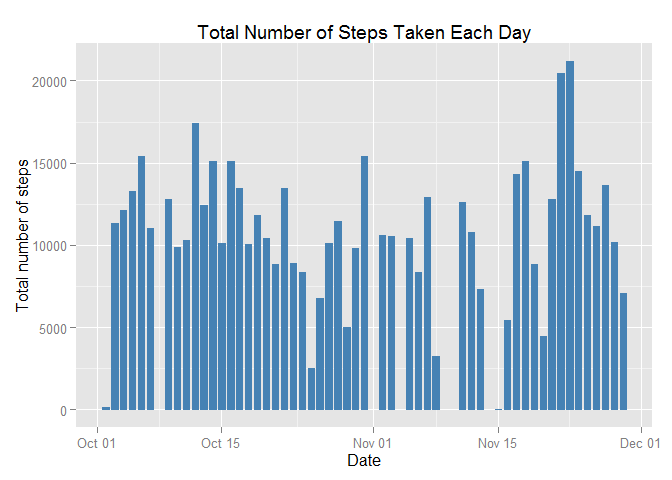
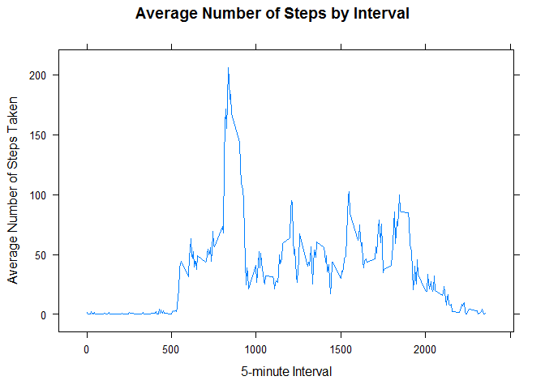
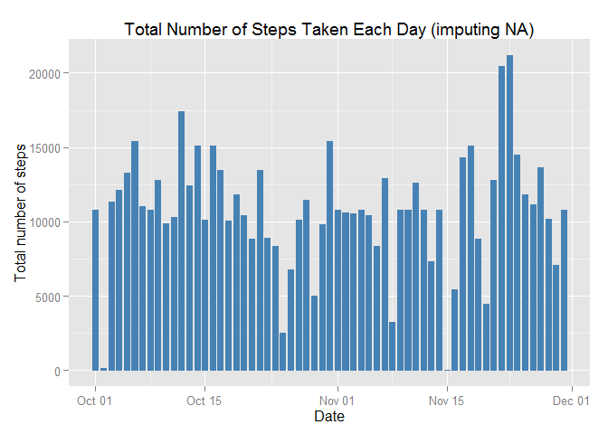
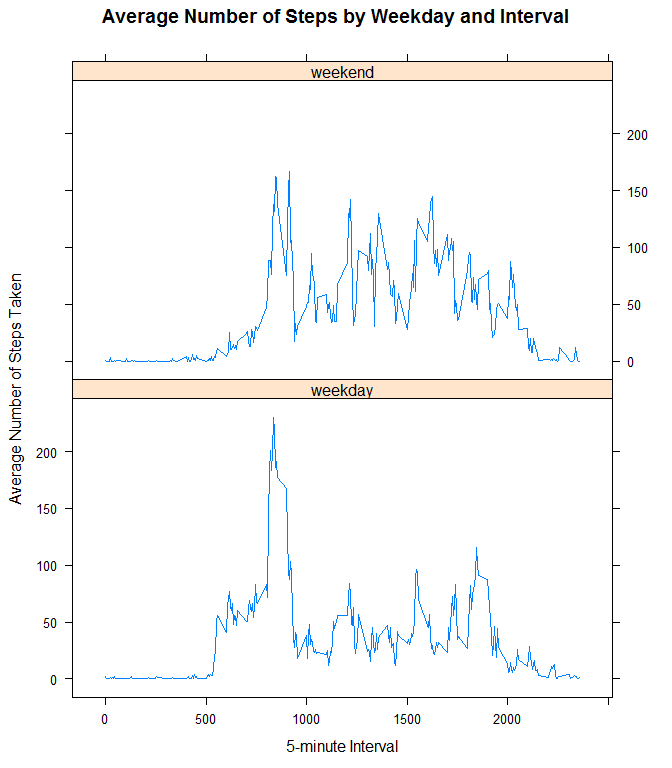

# Reproducible Research: Peer Assessment 1
created by Datanalyst on March 03, 2015

###Basic settings


```r
echo = TRUE
```

Load relevant libraries:

```r
library(lattice)
library(ggplot2)
```

###Loading and preprocessing the data

* Load the data 


```r
unzip("activity.zip")
```


```r
activity <- read.csv("activity.csv", header = TRUE, colClasses = c("integer", "Date", "integer"))
```


```r
str(activity)
```

```
## 'data.frame':	17568 obs. of  3 variables:
##  $ steps   : int  NA NA NA NA NA NA NA NA NA NA ...
##  $ date    : Date, format: "2012-10-01" "2012-10-01" ...
##  $ interval: int  0 5 10 15 20 25 30 35 40 45 ...
```


* Process/transform the data into a format suitable for your analysis

Subset the original dataset by omitting NA values:

```r
activity_noNA <- na.omit(activity)
```


### What is mean total number of steps taken per day? 

* Make a histogram of the total number of steps taken each day


```r
ggplot(activity_noNA, aes(date, steps)) +
        geom_bar(stat = "identity", colour = "steelblue", fill = "steelblue", width = 0.7) + 
        xlab("Date") +
        ylab("Total number of steps")+
        ggtitle("Total Number of Steps Taken Each Day")
```

 


* Calculate and report the mean and median total number of steps taken per day


```r
TotalSteps <- aggregate(steps~date, data = activity_noNA , sum)
```


```r
mean(TotalSteps$steps)
```

```
## [1] 10766.19
```


```r
median(TotalSteps$steps)
```

```
## [1] 10765
```


### What is the average daily activity pattern?

* Make a time series plot (i.e. type = "l") of the 5-minute interval (x-axis) and the average number of steps taken, averaged across all days (y-axis)


```r
AvgSteps <- aggregate(steps~ interval, data = activity_noNA, mean)
```


```r
xyplot(steps ~ interval, data = AvgSteps,
       layout = c(1, 1), type = "l", 
       xlab = "5-minute Interval", ylab = "Average Number of Steps Taken",
       main = "Average Number of Steps by Interval")
```

 


* Which 5-minute interval, on average across all the days in the dataset, contains the maximum number of steps?


```r
AvgSteps[AvgSteps$steps == max(AvgSteps$steps),]
```

```
##     interval    steps
## 104      835 206.1698
```


### Imputing missing values

* Calculate and report the total number of missing values in the dataset (i.e. the total number of rows with NAs)


```r
sum(is.na(activity))
```

```
## [1] 2304
```


* Devise a strategy for filling in all of the missing values in the dataset. 

My strategy is to use the mean for that 5-minute interval to fill each NA value in the steps column.


```r
head(activity)
```

```
##   steps       date interval
## 1    NA 2012-10-01        0
## 2    NA 2012-10-01        5
## 3    NA 2012-10-01       10
## 4    NA 2012-10-01       15
## 5    NA 2012-10-01       20
## 6    NA 2012-10-01       25
```

* Create a new dataset that is equal to the original dataset but with the missing data filled in.


```r
new_activity <- activity
```


```r
for (i in 1:nrow(new_activity)) {
        if (is.na(new_activity$steps[i])) {
                new_activity$steps[i] <- AvgSteps[new_activity$interval[i] == AvgSteps$interval,]$steps
        }
}
```

Let's look at the new dataset:


```r
head(new_activity)
```

```
##       steps       date interval
## 1 1.7169811 2012-10-01        0
## 2 0.3396226 2012-10-01        5
## 3 0.1320755 2012-10-01       10
## 4 0.1509434 2012-10-01       15
## 5 0.0754717 2012-10-01       20
## 6 2.0943396 2012-10-01       25
```


```r
sum(is.na(new_activity))
```

```
## [1] 0
```


* Make a histogram of the total number of steps taken each day. 


```r
ggplot(new_activity, aes(date, steps)) + 
        geom_bar(stat = "identity", colour = "steelblue",fill = "steelblue", width = 0.7) + 
        xlab("Date") +
        ylab("Total number of steps")+
        ggtitle("Total Number of Steps Taken Each Day (imputing NA)")
```

 


* Calculate and report the mean and median total number of steps taken per day.


```r
new_TotalSteps <- aggregate(steps~date, data = new_activity, sum)
```


```r
mean(new_TotalSteps$steps)
```

```
## [1] 10766.19
```


```r
median(new_TotalSteps$steps)
```

```
## [1] 10766.19
```

* Do these values differ from the estimates from the first part of the assignment? What is the impact of imputing missing data on the estimates of the total daily number of steps?


```r
mean(new_TotalSteps$steps) - mean(TotalSteps$steps)
```

```
## [1] 0
```


```r
median(new_TotalSteps$steps) - median(TotalSteps$steps)
```

```
## [1] 1.188679
```

After imputing the missing data, the new mean of total steps taken per day is the same as that of the old mean, while the new median of total steps taken per day is greater than that of the old median.


### Are there differences in activity patterns between weekdays and weekends?

* Create a new factor variable in the dataset with two levels -- "weekday" and "weekend" indicating whether a given date is a weekday or weekend day.


```r
new_activity$weekday <- ifelse(factor(weekdays(new_activity$date)) %in% c("Saturday", "Sunday"), "weekend", "weekday")
```


```r
table(new_activity$weekday)
```

```
## 
## weekday weekend 
##   12960    4608
```

* Make a panel plot containing a time series plot (i.e. type = "l") of the 5-minute interval (x-axis) and the average number of steps taken, averaged across all weekday days or weekend days (y-axis).


```r
new_AvgSteps <- aggregate(steps ~ weekday + interval, data = new_activity, mean)
```


```r
xyplot(steps~ interval | weekday, data = new_AvgSteps,
       layout = c(1, 2), type = "l", 
       xlab = "5-minute Interval", ylab = "Average Number of Steps Taken",
       main = "Average Number of Steps by Weekday and Interval")
```


